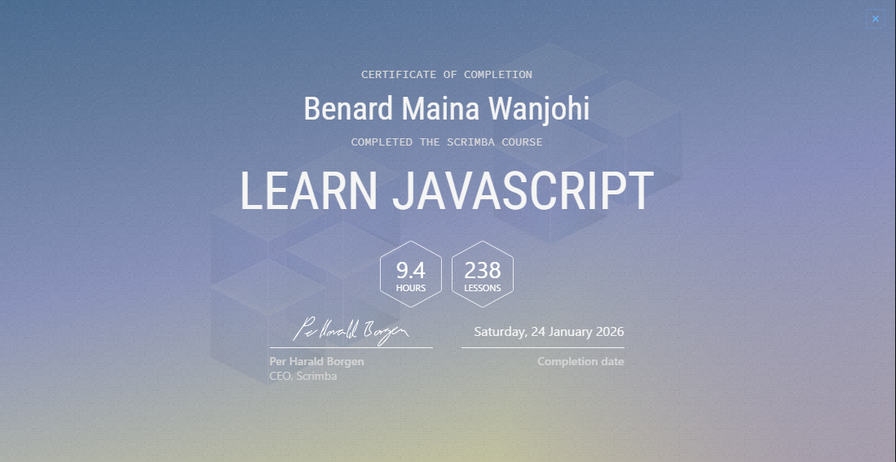
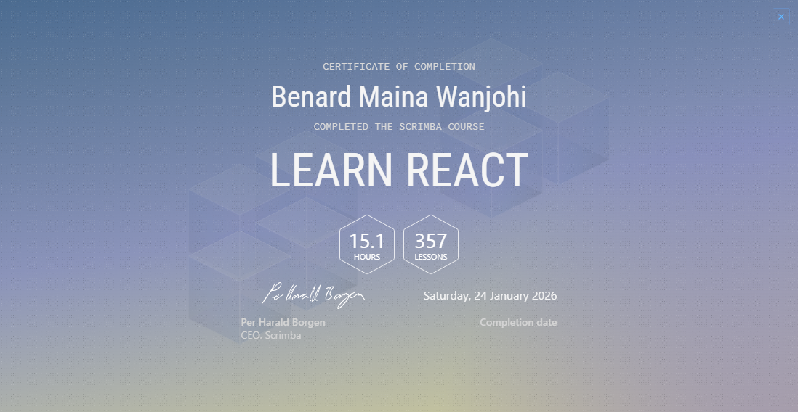
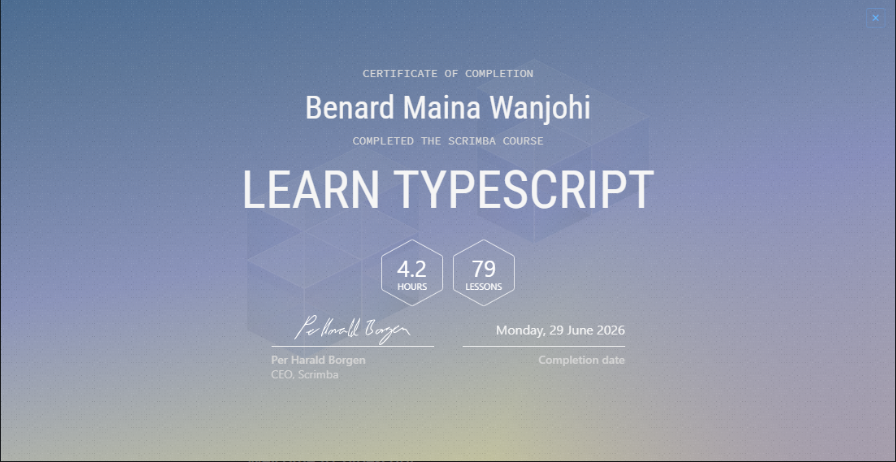

# Certifications

A collection of certifications demonstrating my learning and development in modern frontend technologies.

## Certificate Gallery

<table>
  <tr>
    <td align="center"></td>
    <td align="center"></td>
  </tr>
  <tr>
    <td align="center"></td>
    <td align="center"></td>
  </tr>
  <tr>
    <td align="center"></td>
    <td align="center"></td>
  </tr>
  <tr>
    <td align="center" colspan="2"></td>
  </tr>
</table>

## Skills Covered

These certifications reflect my learning across HTML, CSS, JavaScript, React, TypeScript, Tailwind CSS, accessibility, responsive design, and modern frontend development practices.

## Provider

All certificates were completed through **Scrimba**.